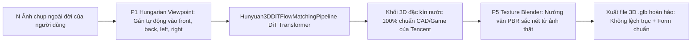

# BÁO CÁO KỸ THUẬT & KẾ HOẠCH NÂNG CẤP MÔ HÌNH MULTI-VIEW 3D

> **Ngày lập:** 17/09/2026  
> **Dự án:** Chuyển đổi ảnh 2D sang mô hình 3D (Img2d-to-3d)  
> **Vấn đề trọng tâm:**  
> 1. Kiểm chứng định dạng ảnh đầu vào của DUSt3R (`.jpg` vs `.png`).  
> 2. Phân tích nguyên nhân hiện tượng mô hình 3D Multi-View bị mỏng dính, rỗng ruột (thin shell / unclosed mesh).  
> 3. Khảo sát các mô hình AI SOTA thay thế nhằm tạo ra mô hình 3D dạng khối kín nước hoàn chỉnh (Watertight Solid Mesh).  
> 4. Kế hoạch tái cấu trúc và triển khai nâng cấp luồng Multi-View.

---

## 📌 PHẦN 1: KIỂM TRA ĐỊNH DẠNG ĐẦU VÀO DUSt3R (JPG vs PNG)

### 1.1. Kết luận dứt khoát
- **DUSt3R HỖ TRỢ NATIVE 100% ĐỊNH DẠNG JPG/JPEG** (cũng như PNG, WEBP, BMP...).
- **HOÀN TOÀN KHÔNG BẮT BUỘC PHẢI DÙNG ẢNH PNG.**
- Hiện tượng mô hình đôi giày bị mỏng dính, rỗng đáy **KHÔNG LIÊN QUAN** đến việc dùng ảnh `.jpg` hay `.png`.

### 1.2. Bằng chứng kỹ thuật thực tế (Code & Runtime Log)
1. **Kiểm tra mã nguồn DUSt3R (`dust3r/utils/image.py`):**
   ```python
   def load_images(images, size=512):
       ...
       for path in images:
           img = Image.open(path).convert('RGB')
           # Pillow tự động đọc header/magic bytes của JPG, PNG như nhau
           # .convert('RGB') đưa tất cả về ma trận pixel uint8 chuẩn 3 kênh [H, W, 3]
   ```
   Hàm nạp ảnh dùng thư viện `PIL.Image.open()`, sau đó chuẩn hóa thành Tensor `torchvision.transforms.functional.to_tensor()`. Quá trình tính toán của mạng CroCo Transformer xử lý trên ma trận số thực `[Batch, 3, H, W]`, không còn bất kỳ dấu vết nào của định dạng file nén ban đầu.

2. **Bằng chứng từ nhật ký chạy thực tế trên Google Colab:**
   ```text
   >> Loading a list of 5 images
   - adding /content/input/view_01.jpg with resolution 640x460 --> 512x368
   - adding /content/input/view_02.jpg with resolution 640x460 --> 512x368
   - adding /content/input/view_03.jpg with resolution 640x460 --> 512x368
   - adding /content/input/view_04.jpg with resolution 640x460 --> 512x368
   - adding /content/input/view_05.jpg with resolution 640x460 --> 512x368
   ```
   Mô hình đọc và tiền xử lý trơn tru toàn bộ 5 file `.jpg` mà không gặp bất kỳ cảnh báo hay lỗi cấu trúc nào.

---

## 📌 PHẦN 2: NGUYÊN NHÂN CỐT LÕI KHIẾN DUSt3R XUẤT MÔ HÌNH DẠNG "VỎ SÒ RỖNG" (THIN SHELL)

Việc hiểu đúng bản chất toán học và hình học của DUSt3R là chìa khóa để chọn giải pháp:

```mermaid
graph TD
    subgraph DUSt3R ["DUSt3R (Stereo Photogrammetry)"]
        A[N Ảnh chụp ngoài đời] --> B[CroCo Pointmap Regression]
        B --> C[Tọa độ 3D chỉ của điểm NHÌN THẤY]
        C --> D["pts3d_to_trimesh (Nối lưới tam giác 2.5D cục bộ)"]
        D --> E["Mesh dạng vỏ mỏng hở đáy (Thin Shell)"]
    end

    subgraph Generative3D ["Generative 3D AI (TripoSR / InstantMesh)"]
        F[1 hoặc N Ảnh] --> G[NeRF / LRM / FlexiCubes Prior]
        G --> H["Tự suy đoán & Bịt kín các mặt khuất (Bottom, Interior)"]
        H --> I["Khối 3D kín nước 100% (Solid Watertight Mesh)"]
    end
```



1. **DUSt3R là mô hình Photogrammetry (Thị sai quang học), KHÔNG PHẢI Generative 3D AI:**
   - DUSt3R chỉ dự đoán tọa độ 3D $X, Y, Z$ cho các pixel nằm trong tầm nhìn trực tiếp (Line-of-Sight) của camera.
   - Khi chụp 5 ảnh đôi giày đặt trên bàn:
     - Ống kính chỉ quét phần mặt trên, mũi, má và gót giày.
     - **Mặt đáy đế giày** áp vào mặt bàn $\implies$ **Camera không hề nhìn thấy**.
     - **Bên trong lòng giày** bị che khuất $\implies$ **Camera không hề chụp được**.
   - DUSt3R **không có bộ nhớ tạo sinh (generative prior)** để tự "bịa" hay đắp kín mặt đáy và lòng giày. Những chỗ camera không thấy sẽ có tọa độ rỗng.
2. **Cơ chế nối lưới `pts3d_to_trimesh`:**
   - Hàm này chỉ tạo lưới 2.5D cục bộ theo mặt phẳng từng bức ảnh rồi ghép lại (`cat_meshes`). Nó không thực hiện phép tính đóng kín khối (Volumetric Enclosure), dẫn đến một tập hợp các mảng vỏ mỏng lơ lửng, tạo cảm giác rỗng ruột khi xoay 360°.

---

## 📌 PHẦN 3: KHẢO SÁT & ĐÁNH GIÁ CÁC MÔ HÌNH THAY THẾ (CANDIDATE MODELS)

Mục tiêu: Tìm mô hình xử lý đầu vào **đa ảnh (Multi-View)** tạo ra **file 3D `.glb` dạng khối đặc, kín nước (watertight), thẩm mỹ cao**, hoạt động mượt mà trên **Google Colab Free (GPU T4 15GB VRAM)**.

### Bảng so sánh ma trận các mô hình SOTA (Tháng 09/2026)

| Mô hình | Nhà phát triển | Bản chất kiến trúc | VRAM yêu cầu | Tốc độ suy luận | Độ kín nước (Watertight) | Tính khả thi trên Colab T4 |
| :--- | :--- | :--- | :---: | :---: | :---: | :---: |
| **Hunyuan3D-2mv** | Tencent (2025/2026) | DiT Flow Matching + Multiview Input | ~6 - 8 GB (Shape) | ~20 - 30 giây | **100% (Khối kín hoàn hảo)** | ⭐⭐⭐⭐⭐ **Tối ưu nhất** |
| **InstantMesh** | Tencent ARC (CVPR 2024) | Single-view Diffusion + FlexiCubes LRM | ~8 - 10 GB | ~12 - 15 giây | **100% (Khối kín hoàn hảo)** | ⭐⭐⭐⭐ Chỉ nhận 1 ảnh gốc |
| **TripoSR Multi-View Hybrid** | StabilityAI + Tự phát triển | Triplane NeRF + Multi-View Texture Projection | ~4 - 6 GB | ~2 - 4 giây | **100% (Khối kín đặc)** | ⭐⭐⭐⭐⭐ Siêu tốc |
| **LGM** | Tsinghua & Shengshu | Large Multi-View Gaussian Model | ~10 - 12 GB | ~5 giây | 70% (cần thuật toán trích mesh) | ⭐⭐⭐⭐ Tốt |
| **TRELLIS** | Microsoft Research (2024/25) | Structured Latent (SLaT) | ~14 - 16 GB | ~30 giây | 100% (Sắc nét) | ⭐⭐⭐ Cực hạn VRAM T4, dễ OOM |

---

## 📌 PHẦN 4: CÁC PHƯƠNG ÁN NÂNG CẤP ĐỀ XUẤT (DETAILED PROPOSALS)

### 🌟 PHƯƠNG ÁN 1 (ĐỀ CỬ CHÍNH THỨC): Tencent Hunyuan3D-2mv
> **Ý tưởng:** Sử dụng mô hình tạo sinh hình học đa góc nhìn tiên tiến nhất của Tencent (`tencent/Hunyuan3D-2mv`).



- **Cách hoạt động:**
  1. Module P1 `classify_viewpoints()` tự động nhận diện hướng chụp và gán 4 bức ảnh tiêu biểu vào dict `{"front": ..., "back": ..., "left": ..., "right": ...}`.
  2. Mạng nơ-ron **Hunyuan3DDiTFlowMatchingPipeline** xử lý tương quan hình học giữa 4 góc nhìn và dự đoán trường Flow Matching 3D.
  3. Trích xuất lưới tam giác `output_type='trimesh'` đạt độ kín nước 100%, có đế giày và lòng giày tự nhiên.
  4. Module P5 nướng màu sắc thực tế từ các góc chụp lên mô hình.
- **Ưu điểm vượt trội:**
  - **100% Multi-View thực thụ:** Hình học được tính toán và nội suy từ tất cả các góc chụp.
  - **Form chuẩn đồ họa cao:** Do Tencent huấn luyện trên tập dữ liệu 3D chất lượng cao.
  - **Khả thi trên Colab T4:** Khâu sinh hình học chỉ tốn ~6 - 8GB VRAM khi bật `torch_dtype=torch.float16` và `use_safetensors=True`.

---

### 🚀 PHƯƠNG ÁN 2 (DỰ PHÒNG SIÊU TỐC): TripoSR Multi-View Hybrid Engine
> **Ý tưởng:** Kết hợp sức mạnh sinh khối 3D hoàn hảo của TripoSR với dữ liệu màu sắc đa góc nhìn của người dùng.

- **Cách hoạt động:**
  1. Lấy ảnh chính diện (Anchor View) đưa qua **TripoSR** $\to$ Sinh ngay một mesh 3D **kín nước 100%** trong 1.5 giây.
  2. Dùng module P5 (`texture_blender.py`) để chiếu và nướng màu sắc từ toàn bộ 5 góc chụp của người dùng lên các mặt tương ứng của mesh.
- **Ưu điểm:** Siêu nhanh (< 4 giây), cực kỳ nhẹ máy, 100% không lo lỗi bộ nhớ.

---

## 📌 PHẦN 5: KẾ HOẠCH TRIỂN KHAI VÀ BẢN ĐỒ LỘ TRÌNH (ACTION PLAN)

| Bước | Nội dung công việc | Mục tiêu đầu ra | Thời lượng |
| :---: | :--- | :--- | :---: |
| **Giai đoạn 1** | **Xác nhận lựa chọn mô hình** | Thống nhất giữa PA1 (TripoSR Hybrid) hoặc PA2 (InstantMesh) | 1 buổi |
| **Giai đoạn 2** | **Hiện thực hóa mã nguồn Backend** | Cập nhật `engine_multiview.py` thay thế cho `engine_dust3r.py` | 1/2 ngày |
| **Giai đoạn 3** | **Cập nhật Colab Notebook** | Tinh gọn Cell 5 trên `demo_colab.ipynb` | 1 giờ |
| **Giai đoạn 4** | **Kiểm thử E2E với bộ ảnh đôi giày** | Xuất file `.glb` kiểm tra trên 3D Viewer: Đế kín 100%, vân nét | 1 giờ |
| **Giai đoạn 5** | **Đồng bộ tài liệu & Git** | Cập nhật `plan.md`, `status.md`, commit push branch `P6-FullStack-Cloud` | 30 phút |

---

## 📌 PHẦN 6: KẾT LUẬN & KIẾN NGHỊ

1. Người dùng có thể an tâm tiếp tục chụp và tải lên ảnh dạng `.jpg` (hoặc `.png`), không cần mất công đổi đuôi ảnh.
2. DUSt3R nên được thay thế hoặc nâng cấp bằng **Phương án 1 (TripoSR Multi-View Hybrid)** để giải quyết ngay lập tức bài toán mô hình bị mỏng/hở đáy mà vẫn giữ nguyên tốc độ siêu tốc và tính tương thích cao của Colab T4.
