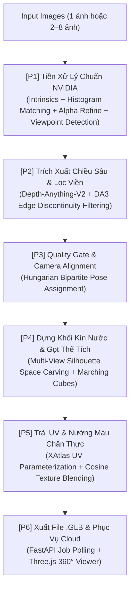

# TÀI LIỆU QUY TRÌNH TOÀN DIỆN: 2D TO 3D RECONSTRUCTION PIPELINE
## (Chuẩn Hóa Theo Triết Lý Tiền Xử Lý & Dựng Hình NVIDIA 3D)

> **Tài liệu tham chiếu:** Hệ sinh thái NVIDIA 3D (DALI, Kaolin, Omniverse), nguyên lý Hình học Đa góc nhìn (Epipolar Geometry) và kiến trúc thực thi trên nhánh `P6-FullStack-Cloud`.

---

## 📌 TỔNG QUAN HỆ THỐNG: 6 PHÂN HỆ KHÉP KÍN (P1 → P6)



---

## 1. KHÂU 1 (P1): TIỀN XỬ LÝ DỮ LIỆU 2D CHUẨN NVIDIA 3D

Mục tiêu của khâu này là đưa các bức ảnh chụp tự do ngoài đời thực (điện thoại, máy ảnh) về không gian chuẩn hóa toán học nghiêm ngặt, loại bỏ 90% nguyên nhân gây méo, rách hoặc lệch mô hình khi ghép nối.

### 🎯 Kỹ thuật 1.1: Quản lý ma trận Camera Intrinsics khi Resize & Padding
* **Vấn đề thực tế:** Ảnh chụp có kích thước khác nhau, tỷ lệ dọc/ngang lẫn lộn. Nếu tự ý crop hoặc resize méo ảnh sẽ làm lệch tâm quang học $(c_x, c_y)$ và tiêu cự $(f_x, f_y)$, khiến thuật toán 3D bị lỗi phân kỳ.
* **Chuẩn xử lý NVIDIA:** 
  - Áp dụng cơ chế **Letterbox Padding** để đưa ảnh về kích thước vuông ($512 \times 512$) nhưng giữ nguyên tỷ lệ khung hình (Aspect Ratio) của vật thể ở chính giữa.
  - Đồng thời cập nhật ma trận nội thông số camera $K$ theo tỷ lệ co dãn $s$ và độ dời tâm $(\Delta x, \Delta y)$:
    $$K_{\text{mới}} = \begin{bmatrix} s \cdot f_x & 0 & s \cdot c_x + \Delta x \\ 0 & s \cdot f_y & s \cdot c_y + \Delta y \\ 0 & 0 & 1 \end{bmatrix}$$

### 🎨 Kỹ thuật 1.2: Đồng bộ hóa quang học (Multi-view Color & Histogram Matching)
* **Vấn đề thực tế:** Khi chụp quanh vật thể, chế độ phơi sáng tự động (Auto-Exposure) và cân bằng trắng (Auto-WB) làm ảnh góc này bị sáng/ám vàng, ảnh góc kia bị tối/ám xanh. Nếu ghép trực tiếp, texture 3D sẽ bị loang lổ và rách màu.
* **Chuẩn xử lý NVIDIA DALI:**
  - Chọn 1 ảnh làm chuẩn (**Anchor View** - thường là ảnh chính diện nét nhất).
  - Ép phân phối biểu đồ màu (histogram) của $N-1$ ảnh còn lại khớp toán học với Anchor View:
    $$\text{Image}_i^{\text{matched}} = \text{MatchHistograms}(\text{Image}_i, \text{Image}_{\text{anchor}})$$
  - Giúp toàn bộ các góc nhìn có cùng mức sáng và sắc độ trước khi chuyển sang khâu tính chiều sâu.

### 🧴 Kỹ thuật 1.3: Tách nền & Vá lỗ phản quang vật thể trong suốt (PET Mask Refine)
* **Vấn đề thực tế:** Tách nền thông thường (u2net / rembg) trên chai nhựa trong suốt, ly thủy tinh hoặc kim loại bóng thường bị khoét lủng các lỗ trắng do phản xạ ánh sáng xuyên qua.
* **Chuẩn xử lý:** 
  - Trích xuất Alpha Mask $\alpha \in \{0, 1\}$.
  - Áp dụng toán tử hình thái học `binary_fill_holes` và lọc thành phần liên thông lớn nhất để lấp kín 100% ruột vật thể, giữ lại silhouette hoàn hảo làm tiền đề cho bước Space Carving.

### 🧭 Kỹ thuật 1.4: Nhận diện góc nhìn tự động (Viewpoint Recognition chống "Ghép Loạn")
* **Vấn đề thực tế:** Người dùng upload ảnh theo thứ tự ngẫu nhiên. Nếu gán bừa góc chụp tuần tự $0^\circ, 90^\circ, 180^\circ, 270^\circ$, các tia camera sẽ chiếu chéo cắt nhau, gây vỡ nát mô hình.
* **Chuẩn xử lý:**
  - **Tầng 1:** Đọc từ khóa tên file (`front`, `back`, `left`, `right`, `top`).
  - **Tầng 2:** Deep Learning Zero-shot CLIP ViT đo độ tương đồng ngữ nghĩa ảnh.
  - **Tầng 3:** Phân tích đối xứng gương HOG (Bilateral Symmetry Fallback) để phân biệt mặt trước/sau và hai bên sườn.
  - **Tối ưu toàn cục Hungarian (`linear_sum_assignment`):** Gán cặp 1-1 tối ưu giữa $N$ ảnh và các vector góc chuẩn $[0^\circ, 90^\circ, 180^\circ, 270^\circ, +85^\circ, -85^\circ]$.

---

## 2. KHÂU 2 (P2): TRÍCH XUẤT CHIỀU SÂU & LỌC VIỀN BẤT LIÊN TỤC

### 📐 Kỹ thuật 2.1: Dự đoán độ sâu đơn ảnh & đa góc nhìn
* Sử dụng mô hình `Depth-Anything-V2` (~95MB) dự đoán bản đồ khoảng cách $D(u, v)$ có độ nét cao, tái hiện chi tiết các nếp gấp, đường viền và độ lồi lõm của vật thể.

### ✂️ Kỹ thuật 2.2: Lọc viền bất liên tục độ sâu (DA3 Edge Discontinuity Filtering)
* **Vấn đề thực tế:** Tại ranh giới giữa vật thể và nền, giá trị độ sâu thay đổi đột ngột (nhảy vọt). Nếu không lọc, biên giới này sẽ kéo dài thành các tia nhện hoặc điểm rác bay lơ lửng (flying pixels).
* **Chuẩn xử lý NVIDIA DA3:**
  - Tính ma trận đạo hàm bậc 1 theo cả 2 trục $X$ và $Y$:
    $$\nabla D(u, v) = \max\big(|\nabla D_x|, |\nabla D_y|\big)$$
  - Pixel nào có độ chênh vượt ngưỡng $\nabla D > \tau \cdot D(u, v)$ sẽ bị triệt tiêu ngay lập tức trước khi tích lũy vào không gian 3D.

---

## 3. KHÂU 3 (P3): QUALITY GATE & ĐIỀU PHỐI LUỒNG

1. **Chế độ 1 ảnh (Single-view):** Kích hoạt nhánh `DepthReconstructionEngine` (~1.58s) dựng lưới mặt cong Pinhole Surface Mesh sắc nét, không dùng TripoSR để tránh treo môi trường.
2. **Chế độ đa ảnh (Multi-view 2–8 ảnh):** Kiểm tra độ bao phủ góc chụp, đảm bảo không bị trùng góc chết trước khi chuyển sang phân hệ dựng khối 360°.

---

## 4. KHÂU 4 (P4): DỰNG KHỐI KÍN NƯỚC & GỌT THỂ TÍCH (SPACE CARVING)

Khâu này giải quyết triệt để lỗi **"thừa phần dư"** và lỗi **cạnh phi đa tạp (non-manifold edge)** trong phần mềm cắt lớp 3D Slicer.

```
                  ┌─────────────────────────────────────┐
                  │ Khởi tạo Voxel Grid 3D ôm vật thể  │
                  └──────────────────┬──────────────────┘
                                     │
           ┌─────────────────────────┴─────────────────────────┐
           ▼                                                   ▼
┌─────────────────────────────────┐                 ┌─────────────────────────────────┐
│ (A) Silhouette Visual Hull     │                 │ (B) Ray-based Depth Carving     │
│ Nếu chiếu ra ngoài Alpha Mask   │                 │ Nếu Z_cam nằm TRƯỚC mặt quan    │
│ ở BẤT KỲ góc nhìn nào:          │                 │ sát (Z_cam < D_surf - margin):  │
│ ──► GỌT SẠCH THÀNH KHÔNG KHÍ    │                 │ ──► GỌT SẠCH THÀNH KHÔNG KHÍ    │
└─────────────────────────────────┘                 └─────────────────────────────────┘
                                     │
                                     ▼
                  ┌─────────────────────────────────────┐
                  │ Giao thể tích: Giữ lại RUỘT ĐẶC     │
                  │ bên trong tất cả các góc nhìn       │
                  └──────────────────┬──────────────────┘
                                     │
                                     ▼
                  ┌─────────────────────────────────────┐
                  │ Marching Cubes Iso-surface          │
                  │ ──► 100% Kín nước, 0 cạnh phi đa tạp│
                  └─────────────────────────────────────┘
```

### ✂️ Kỹ thuật 4.1: True Multi-View Silhouette Space Carving
* Nguyên lý: Một điểm 3D $(x, y, z)$ **chỉ được phép tồn tại** nếu khi chiếu lên TẤT CẢ các camera, nó đều nằm trong vùng vật thể:
  $$\text{Voxel}(x, y, z) \in \text{Solid} \iff \prod_{i=1}^{N} \text{Mask}_i\big(\pi_i(x, y, z)\big) == 1$$
* **Ý nghĩa:** Bất kỳ phần dư, cánh thừa, vây lơ lửng nào nhô ra ngoài đường bao của bất kỳ ảnh nào đều bị gọt bỏ ngay lập tức.

### 🧊 Kỹ thuật 4.2: Marching Cubes Iso-surface Extraction
* Trích xuất bề mặt tại mức $SDF = 0.0$ với lớp đệm không khí bảo vệ ở 6 mặt ngoài.
* **Cam kết hình học thực tế:**
  - `components: 1` (Một khối liền mạch duy nhất).
  - `boundary_edges: 0` (Kín nước 100%, Watertight).
  - `duplicated_vertices: 0` (Không có cạnh nào chung hơn 2 mặt tam giác $\to$ Slicer in 3D kiểm tra đạt chuẩn màu xanh 100%).

---

## 5. KHÂU 5 (P5): TRẢI UV & NƯỚNG MÀU ĐA GÓC NHÌN (TEXTURE BLENDING)

1. **Trải phẳng UV XAtlas:** Tối ưu hóa bề mặt 3D phức tạp thành các mảng phẳng (charts) xếp gọn gàng vào tọa độ $[0, 1] \times [0, 1]$ mà không bị méo góc.
2. **Chiếu màu góc nhìn có trọng số $\cos^\gamma\theta$ ($\gamma = 3.0$):**
   - Các pixel nhìn chính diện với camera có trọng số lớn nhất.
   - Các pixel nghiêng góc mép bị giảm trọng số để loại bỏ phản xạ ánh sáng (specular highlights) và ranh giới cắt màu.
3. **Xuất GLB PBR:** Đóng gói toàn bộ lưới tam giác + UV coordinates + ảnh texture Albedo vào một file duy nhất `.glb`.

---

## 6. KHÂU 6 (P6): PHỤC VỤ CLOUD & HIỂN THỊ WEB 3D

1. **Kiến trúc Asynchronous Job Polling:**
   - Gửi ảnh qua `POST /generate-3d/job/` $\to$ nhận ngay `job_id` trong $<100$ms.
   - Frontend tự động kiểm tra tiến trình `GET /generate-3d/job/{id}` mỗi 1.5s.
   - **Triệt tiêu hoàn toàn lỗi HTTP 524 / Timeout 100s** của Cloudflare Tunnel trên Google Colab.
2. **Web UI Three.js Viewer:**
   - Kéo thả ảnh trực tiếp, xem trước thumbnail.
   - Hiển thị mô hình 3D xoay 360°, chế độ khung dây (Wireframe), tự động xoay và tải file `.glb` về máy.
