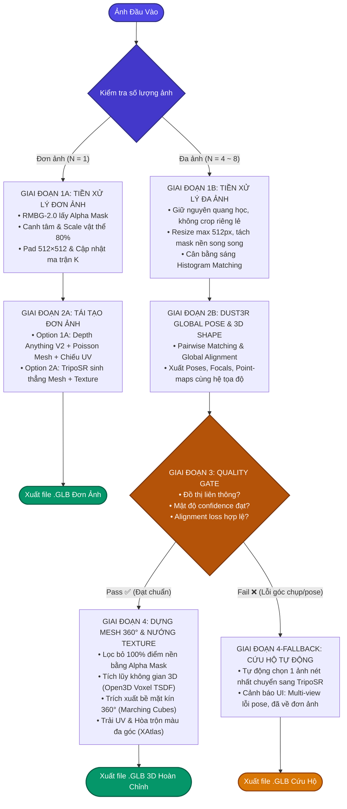

# PHÂN TÍCH CHUYÊN SÂU CÁC REPO THAM KHẢO & THIẾT KẾ LUỒNG TỪ N ẢNH 2D SANG MÔ HÌNH 3D

> **Tài liệu căn cứ:** 
> Dựa trên 3 kho mã nguồn tham khảo được liệt kê trong [reference.md](../ImgToModel/docs/reference.md):
> 1. `https://github.com/NVIDIA/3DObjectReconstruction` (NVIDIA Reference Workflow)
> 2. `https://github.com/xy-gao/DA3-blender` (Depth Anything 3 Blender Integration & Streaming)
> 3. `https://github.com/DepthAnything/Depth-Anything-V2` (Foundation Model SOTA)

---

## 📌 PHẦN 1: BÓC TÁCH CHI TIẾT TỪNG REPO THAM KHẢO

---

### 1. Repo 1: NVIDIA / 3DObjectReconstruction

*Link:* [https://github.com/NVIDIA/3DObjectReconstruction](https://github.com/NVIDIA/3DObjectReconstruction)

#### a. Mục tiêu & Bản chất dự án
Đây là giải pháp quy chuẩn công nghiệp (Reference Pipeline) do NVIDIA phát triển nhằm mục đích số hóa các vật thể vật lý ngoài đời thực thành mô hình 3D đa giác có texture chân thực cao (photorealistic textured mesh). Output xuất ra định dạng `.obj`, `.usd`, hoặc `.usdz` phục vụ trực tiếp cho mô phỏng robot (NVIDIA Isaac Sim), game engine và đồ họa kỹ thuật số.

#### b. Kiến trúc thuật toán & Luồng xử lý chi tiết (Pipeline)

```
[Stereo / Multi-View Images] + [Camera Metadata]
                       ↓
   [Theseus GPU Pose Optimizer] (Tối ưu quỹ đạo camera & Bundle Adjustment)
                       ↓
     [Multi-View Stereo / Depth Estimation] (Tính toán độ sâu từng cặp ảnh)
                       ↓
   [Volumetric Fusion (TSDF Voxel Grid)] (Tích lũy khối hình học có dấu)
                       ↓
   [Configurable Color Fusion] (Hòa trộn màu sắc, khử phản xạ bề mặt)
                       ↓
    [Marching Cubes Extraction] (Trích xuất Iso-surface Mesh)
                       ↓
 [UV Mapping & PBR Texture Baking] → Xuất file .OBJ / .USD
```

1. **Thuật toán Tối ưu hóa Pose (Theseus GPU Pose Optimizer):**
   - Thay vì dựa vào các giải thuật SFM CPU truyền thống chậm chạp, NVIDIA tích hợp thư viện **Theseus** (thư viện tối ưu phi tuyến khả vi chạy hoàn toàn trên GPU của Meta/NVIDIA).
   - Thuật toán giải bài toán bình phương tối thiểu phi tuyến (Non-linear Least Squares qua Gauss-Newton / Levenberg-Marquardt) để đồng thời tinh chỉnh góc xoay $R_i$, vector tịnh tiến $T_i$ và tọa độ 3D của các điểm tương đồng, loại bỏ sai số trôi (drift error) giữa $N$ khung hình.
2. **Thuật toán Dung hợp thể tích (Volumetric Fusion qua TSDF):**
   - Không gộp các điểm point cloud lại một cách thô sơ, pipeline sử dụng **Truncated Signed Distance Function (TSDF)** trên lưới Voxel 3D.
   - Khoảng cách từ mỗi voxel đến bề mặt vật thể được cập nhật liên tục thông qua trung bình có trọng số của toàn bộ $N$ góc nhìn.
3. **Thuật toán Hòa trộn màu sắc thích ứng (Configurable Color Fusion):**
   - Đây là điểm nâng cấp vượt trội của NVIDIA: Khi chụp các vật thể kim loại, phản quang hoặc bề mặt nhẵn bóng không có vân (textureless), ánh sáng phản xạ sẽ làm biến dạng màu sắc giữa các góc chụp.
   - Thuật toán Color Fusion phân tích góc phản xạ Fresnel và độ tin cậy để loại bỏ ánh sáng chói lóa (specular highlights), chỉ nướng màu khuếch tán thực (diffuse color) lên bề mặt 3D.
4. **Dựng lưới đa giác (Marching Cubes):**
   - Quét qua lưới TSDF để trích xuất mặt đẳng trị (zero-crossing surface) $\to$ Đảm bảo mesh tạo ra luôn **kín nước (watertight)** và không bị hở mặt sau.

#### c. Nhận xét & Khả thi trên Google Colab Free (T4)
- **Ưu điểm:** Độ chuẩn xác hình học và chất lượng texture ở cấp độ thương mại công nghiệp.
- **Hạn chế:** Hệ thống thiết kế nguyên khối (monolithic Docker container), yêu cầu môi trường phần cứng mạnh (tối ưu nhất cho RTX 4090 / A100 / Blackwell), phụ thuộc nhiều vào dữ liệu ảnh stereo chuẩn kèm thông số camera chính xác.
- **Bài học rút ra cho dự án:** Không nên bê nguyên cả repo NVIDIA lên Colab T4 vì rất dễ lỗi môi trường Docker và tràn RAM; **nhưng BẮT BUỘC PHẢI HỌC HỎI 2 THUẬT TOÁN CỐT LÕI**: **TSDF Fusion** và **Color Fusion với Marching Cubes**.

---

### 2. Repo 2: xy-gao / DA3-blender

*Link:* [https://github.com/xy-gao/DA3-blender](https://github.com/xy-gao/DA3-blender)

#### a. Mục tiêu & Bản chất dự án
Đây là một Blender Addon mã nguồn mở cực kỳ thông minh, được thiết kế để đưa sức mạnh của dòng mô hình **Depth-Anything** vào Blender nhằm tái tạo không gian và vật thể 3D từ một chuỗi ảnh (hoặc thư mục ảnh $N$ tấm).

#### b. Các thuật toán & Kỹ thuật xử lý chuỗi $N$ ảnh xuất sắc

```
[Thư mục N ảnh 2D] 
       ↓
[DA3 Streaming Chunks] (Cắt chuỗi ảnh thành các batch nhỏ có Overlap)
       ↓
[Depth-Anything FP16 Engine] (Dự đoán depth map cho từng ảnh)
       ↓
[Filter Edges & Confidence Masking] (Cắt tỉa viền xơ xác & lọc điểm nhiễu)
       ↓
[Ray-based Pose Projection] (Chiếu tia camera vào không gian Blender)
       ↓
[Geometry Nodes Point Cloud] → [Mesh Surface Reconstruction]
```

1. **Chiến lược Chồng lấn khung hình (Frame Overlap Strategy) trong DA3 Streaming:**
   - Khi xử lý một danh sách lớn $N$ ảnh, chạy toàn bộ cùng lúc sẽ làm sập RAM/VRAM. Tác giả chia thành các "chunk" (lô ảnh nhỏ).
   - Để các chunk không bị lệch vị trí khi ghép lại, tác giả áp dụng:
     - **Last Frame Overlap:** Frame cuối của batch trước được đưa làm frame đầu của batch sau.
     - **First-Last Overlap:** Lấy 2 frame gối đầu để thiết lập hệ quy chiếu tọa độ neo (Anchor Coordinate System) đồng nhất giữa các mảng điểm.
2. **Kỹ thuật Lọc cạnh vật thể (Filter Edges):**
   - Điểm yếu cố hữu lớn nhất của mọi mô hình monocular depth (như Depth Anything) là hiện tượng **"Edge Bleeding / Edge Tearing"**: Tại đường biên phân tách giữa vật thể và hậu cảnh, gradient độ sâu biến thiên đột ngột dẫn đến việc sinh ra hàng loạt điểm point cloud "lơ lửng" kéo dài như mạng nhện (flying pixels).
   - Thuật toán `Filter Edges` tính toán gradient ma trận độ sâu $\nabla D = \sqrt{(\frac{\partial D}{\partial x})^2 + (\frac{\partial D}{\partial y})^2}$. Nếu $|\nabla D| > \text{threshold}$, các điểm pixel này sẽ bị triệt tiêu ngay lập tức trước khi chuyển thành 3D.
3. **Lọc theo độ tin cậy (Confidence Thresholding):**
   - Mô hình xuất ra bản đồ độ tin cậy. Các vùng bị mờ nhòe (motion blur) hoặc thiếu sáng có độ tin cậy thấp sẽ bị mask bỏ, tránh làm biến dạng bề mặt 3D.
4. **Tối ưu bộ nhớ FP16:**
   - Ép kiểu trọng số mô hình và tensor sang `torch.float16`, giảm 50% mức tiêu thụ VRAM trên GPU.

#### c. Bài học rút ra cho dự án
- Repo này giải quyết đúng bài toán đau đầu nhất của nhóm: **Làm sao xử lý chuỗi $N$ ảnh bằng Depth Anything mà không bị rách cạnh vật thể?**
- Chúng ta phải đưa kỹ thuật **Edge Gradient Filtering** và **Batch Chunking** này vào pipeline xử lý trên Colab.

---

### 3. Repo 3: DepthAnything / Depth-Anything-V2

*Link:* [https://github.com/DepthAnything/Depth-Anything-V2](https://github.com/DepthAnything/Depth-Anything-V2)

#### a. Vấn đề cốt tử: Relative Depth vs. Metric Depth
Trong tài liệu trước, chúng ta đã chỉ ra: Nếu dùng bản Depth Anything V2 mặc định (Relative Depth), $N$ ảnh sẽ cho ra $N$ thang đo độ sâu ngẫu nhiên, không thể nào khớp hình học lại với nhau được.

Tuy nhiên, khi đào sâu vào repo chính thức của Depth-Anything-V2, ta phát hiện một chìa khóa cực kỳ quan trọng: **Subdirectory `metric_depth/`**.

| Đặc tính so sánh | Bản Mặc định (Relative Depth) | Bản Chuyên biệt (Metric Depth) |
| :--- | :--- | :--- |
| **Bản chất đầu ra** | Khoảng cách tương đối chuẩn hóa (0 → 1) | **Khoảng cách thực tế tính bằng mét (Z thực)** |
| **Checkpoints** | `depth_anything_v2_vits.pth` | `depth_anything_v2_metric_hypersim_vits.pth` (cho trong nhà)<br>`depth_anything_v2_metric_vkitti_vits.pth` (cho ngoài trời) |
| **Dung lượng VRAM (Small)** | ~0.3 GB | **~0.35 GB** (vẫn siêu nhẹ!) |
| **Khả năng ghép $N$ ảnh** | ❌ Bị méo tỷ lệ (Scale Ambiguity) | ✅ **Cùng hệ quy chiếu mét thực tế! Các ảnh có thể back-project và ráp khớp vào nhau.** |

#### b. Kiến trúc mạng của Metric Depth
- **Backbone:** DINOv2 (ViT-Small với 24.8M tham số).
- **Decoder:** DPT (Dense Prediction Transformer) Head được tinh chỉnh (fine-tuned) trên tập dữ liệu Hypersim (chứa độ sâu mặt đất thực tế với ground truth bằng laser scan).
- **Hàm suy luận:**
  $$Z_{(u, v)} = \text{DepthAnythingMetric}(I_{(u, v)}) \quad (\text{đơn vị: mét})$$

---

## 📌 PHẦN 2: BẢNG MA TRẬN SO SÁNH 3 REPO THAM KHẢO

| Tiêu chí | NVIDIA / 3DObjectReconstruction | xy-gao / DA3-blender | Depth-Anything-V2 (Metric) |
| :--- | :--- | :--- | :--- |
| **Mục đích chính** | Tái tạo mesh công nghiệp từ stereo/multi-view | Trực quan hóa & tạo Point Cloud chuỗi ảnh trong Blender | Ước lượng chiều sâu tuyệt đối (Metric Depth) đơn/đa ảnh |
| **Dữ liệu đầu vào** | Stereo / Multi-view + Camera Extrinsics/Intrinsics | Thư mục $N$ ảnh tự do (hoặc video sequence) | Đơn ảnh hoặc Batch $N$ ảnh RGB |
| **Cơ chế Pose Camera** | Tối ưu bằng **Theseus GPU Optimizer** | Đọc từ chuỗi / Ray pose nội suy | Chưa tích hợp (chỉ xuất Depth Map) |
| **Xử lý ghép $N$ ảnh** | **TSDF Volumetric Fusion** | **Batch Overlap Streaming (1-2 frames)** | Đoạn mã Metric loại bỏ Scale Ambiguity |
| **Thuật toán tạo Mesh** | **Marching Cubes** trên TSDF grid | Dùng Geometry Nodes / Poisson Surface trong Blender | Cần code ngoài (Open3D / PyMCubes) |
| **Xử lý Texture** | **Configurable Color Fusion** cao cấp | Gán texture material theo tọa độ UV | Chưa tích hợp |
| **Tải nguyên GPU** | Cần GPU lớn (> 12GB VRAM, Docker) | Nhẹ (hỗ trợ FP16, chạy mượt trên RTX 3060/T4) | **Cực nhẹ** (< 0.5GB VRAM cho bản Small) |
| **Độ khó khi tích hợp vào Colab** | Rất phức tạp (dễ xung đột thư viện C++/CUDA) | Trung bình (cần tách logic Python ra khỏi Blender) | **Rất dễ** (vài chục dòng code PyTorch thuần túy) |

---

## 📌 PHẦN 3: ĐÚC KẾT & THIẾT KẾ KIẾN TRÚC TỐI ƯU CHO BÀI TOÁN $N$ ẢNH 2D SANG 3D

Từ việc phân tích 3 repo trên, ta thấy:
- **Không nên sao chép mù quáng 1 repo duy nhất**, vì mỗi repo có một thế mạnh riêng và điểm yếu riêng.
- **Giải pháp tối ưu nhất:** Kết hợp các thế mạnh tinh hoa của cả 3 repo để tạo thành một pipeline hoàn chỉnh chạy mượt mà trên **Google Colab Free (NVIDIA T4 15GB VRAM, 12GB RAM)**.

### 🌟 SƠ ĐỒ PIPELINE TỔNG THỂ CHUẨN HÓA (2 KỊCH BẢN ĐỘC LẬP)

#### 1. Biểu đồ tương tác Mermaid (Hiển thị đồ họa trực quan)



---

#### 2. Sơ đồ khối ASCII rút gọn (Chống tràn chữ, hiển thị tối ưu trên mọi kích thước màn hình)

##### 🅰️ KỊCH BẢN 1: ĐƠN ẢNH ($N = 1$)
```
[ 1 Ảnh 2D duy nhất ]
         │
         ▼
┌────────────────────────────────────────────────────────┐
│ GIAI ĐOẠN 1A: TIỀN XỬ LÝ ĐƠN ẢNH                       │
│ • RMBG-2.0: Tách nền lấy Alpha Mask                    │
│ • Crop Bounding Box, canh giữa, scale vật thể ~82%     │
│ • Pad viền vuông 512×512, cập nhật ma trận K → K'      │
└────────────────────────┬───────────────────────────────┘
                         │
                         ▼
┌────────────────────────────────────────────────────────┐
│ GIAI ĐOẠN 2A: TÁI TẠO ĐƠN ẢNH                          │
│ • Option 1A (Depth-Anything-V2-Metric):                │
│   Dự đoán Depth → Chiếu ngược Point Cloud              │
│   → Dựng lưới Poisson Mesh → Chiếu Camera UV Texture   │
│ • Option 2A (TripoSR Transformer):                     │
│   Sinh trực tiếp Textured Mesh 3D trong 1.5s           │
└────────────────────────┬───────────────────────────────┘
                         │
                         ▼
   [ XUẤT THẲNG FILE .GLB HOÀN CHỈNH CHO ĐƠN ẢNH ]
```

##### 🅱️ KỊCH BẢN 2: ĐA ẢNH ($N = 4 \sim 8$, TỐI ƯU 6 ẢNH)
```
[ 4 ~ 8 Ảnh chụp quanh vật thể 360° ]
         │
         ▼
┌────────────────────────────────────────────────────────┐
│ GIAI ĐOẠN 1B: TIỀN XỬ LÝ ĐA ẢNH                        │
│ • Không crop riêng lẻ (bảo toàn Epipolar Geometry)     │
│ • Resize max 512px, tách Alpha Mask song song          │
│ • Cân bằng sáng (Histogram Matching giữa các ảnh)      │
└────────────────────────┬───────────────────────────────┘
                         │
                         ▼
┌────────────────────────────────────────────────────────┐
│ GIAI ĐOẠN 2B: ĐỒNG BỘ POSE & HÌNH HỌC (DUSt3R)         │
│ • Pairwise Matching + Global Alignment toàn cục        │
│ • Xuất đồng thời: Camera Poses, Focals, 3D Point-maps  │
│   và bản đồ Confidence trong CÙNG 1 HỆ TỌA ĐỘ.         │
└────────────────────────┬───────────────────────────────┘
                         │
                         ▼
┌────────────────────────────────────────────────────────┐
│ GIAI ĐOẠN 3: BỘ LỌC CHẤT LƯỢNG (QUALITY GATE)          │
│ • Kiểm tra liên thông đồ thị quan sát chung           │
│ • Đạt ngưỡng số lượng pixel tin cậy (Confidence)       │
│ • Mất mát căn chỉnh (Alignment loss) trong mức an toàn │
└────────────────────────┬───────────────────────────────┘
                         │
          ┌──────────────┴──────────────┐
       (Pass ✅)                     (Fail ❌)
          │                             │
          ▼                             ▼
┌───────────────────────────┐ ┌───────────────────────────┐
│ GIAI ĐOẠN 4: DỰNG MESH    │ │ GIAI ĐOẠN 4-FALLBACK:     │
│ 360° & NƯỚNG TEXTURE      │ │ CỨU HỘ TỰ ĐỘNG            │
│ • Lọc sạch điểm nền bằng  │ │ • Tự động chọn 1 ảnh sắc  │
│   Alpha Mask (Point Prune)│ │   nét nhất đưa qua        │
│ • Tích lũy không gian 3D  │ │   TripoSR tạo mesh nhanh. │
│   (Open3D Voxel TSDF)     │ │ • Báo UI: "Multi-view     │
│ • Trích xuất vỏ 360° kín  │ │   lỗi pose, đã tự động    │
│   bằng Marching Cubes     │ │   chuyển sang tạo đơn ảnh"│
│ • Trải UV & hòa trộn màu  │ │ • Đảm bảo 100% không văng │
│   góc nhìn (XAtlas)       │ │   lỗi hay treo hệ thống.  │
└─────────────┬─────────────┘ └─────────────┬─────────────┘
              │                             │
              ▼                             ▼
   [ XUẤT FILE .GLB ĐA ẢNH ]     [ XUẤT FILE .GLB CỨU HỘ ]
```

---

## 📌 PHẦN 4: CHI TIẾT TỪNG THUẬT TOÁN & BẢN CHẤT TOÁN HỌC

---

### Thuật toán 0: Tiền Xử Lý Ảnh Phân Theo 2 Kịch Bản (Single-View vs. Multi-View)

Giai đoạn 1 được tinh gọn chính xác thành 2 trường hợp thực tế:

#### Trường hợp 1: Đơn ảnh ($N = 1$) — Bounding Box Canh Tâm & Chuẩn Hóa Tỉ Lệ (Scale Normalization)
- **Mục tiêu:** Tối ưu hóa kích thước vật thể và đưa về khung vuông $512 \times 512$ cho Depth Anything V2 hoặc TripoSR.
- **Quy trình:**
  1. Tách nền bằng RMBG-2.0 lấy Alpha Mask $\mathbf{M} \in \{0, 1\}^{H \times W}$.
  2. Xác định Bounding Box vật thể: $[x_{\min}, y_{\min}, x_{\max}, y_{\max}]$, tâm vật thể $(c_{x,\text{obj}}, c_{y,\text{obj}})$.
  3. Scale bảo toàn Aspect Ratio để chiều lớn nhất chiếm $80\% \sim 85\%$ khung hình $512 \times 512$:
     $$s = \frac{\eta \cdot S_{\text{target}}}{\max(w_{\text{obj}}, h_{\text{obj}})} \quad (S_{\text{target}} = 512, \eta \approx 0.82)$$
  4. Canh giữa tâm và bù viền (Square Letterbox Padding).
  5. Cập nhật ma trận Camera Intrinsics $K \to K'$ theo hệ số co dãn $s$ và độ dời tâm $(\Delta x, \Delta y)$ để bảo toàn tia chiếu ngược 3D.

#### Trường hợp 2: Đa ảnh ($N = 4 \sim 8$ ảnh, tối ưu 6 ảnh) — Loader Giữ Nguyên Quang Học
- **Giới hạn số lượng:** Hệ thống nhận tối ưu từ $4$ đến $8$ ảnh. Nếu người dùng tải lên nhiều hơn 8 ảnh, hệ thống tự động lọc giữ lại $6 \sim 8$ ảnh phân bổ góc đều nhất quanh $360^\circ$ nhằm giữ số cặp ảnh DUSt3R $\le 28$ cặp, đảm bảo không tràn VRAM GPU T4 và thời gian xử lý $< 10$s.
- **Nguyên tắc sống còn:** **TUYỆT ĐỐI KHÔNG crop hoặc canh tâm Bounding Box riêng lẻ từng ảnh.**
  - *Lý do:* Crop các khung khác nhau sẽ làm lệch tâm quang học $(c_x, c_y)$ bất đối xứng giữa các góc nhìn, phá vỡ cấu trúc Epipolar Geometry khiến DUSt3R dự đoán sai Pose.
- **Quy trình:**
  1. Sử dụng DUSt3R standard image loader: Resize đồng bộ giữ nguyên aspect ratio về kích thước cạnh tối đa 512px (giữ nguyên toàn bộ hậu cảnh để DUSt3R bám điểm đặc trưng).
  2. RMBG-2.0 chạy song song để trích xuất Alpha Mask $\mathbf{M}_i$, lưu sẵn vào bộ nhớ tạm.
  3. Áp dụng Histogram Matching giữa các ảnh nếu có sự chênh lệch ánh sáng lớn giữa các góc chụp.
  4. Sau khi DUSt3R hoàn thành Global Alignment, dùng mask $\mathbf{M}_i$ để **Lọc bỏ điểm nền (Background Point Pruning)** trước khi tích lũy vào TSDF Volume:
     $$\mathbf{X}_{i, \text{valid}}(u, v) = \begin{cases} \mathbf{X}_i(u, v) & \text{nếu } \mathbf{M}_i(u, v) = 1 \text{ và } \mathbf{C}_i(u, v) > \tau_{\text{conf}} \\ \text{Discard} & \text{ngược lại (thuộc nền hoặc nhiễu)} \end{cases}$$

---

### Thuật toán 1: Lọc viền độ sâu (Edge Discontinuity Filtering - Kế thừa từ DA3-blender)
- **Vấn đề:** Khi back-project depth map từ Depth Anything, ở ranh giới giữa vật thể và nền bị xóa, các pixel rìa thường mang giá trị độ sâu trung gian (nằm giữa vật thể và vô cực), tạo ra một "bức rèm" các điểm rác.
- **Công thức:**
  Tính toán biến thiên độ dốc độ sâu theo 2 hướng $x$ và $y$:
  $$G_x(u, v) = |D(u+1, v) - D(u-1, v)|$$
  $$G_y(u, v) = |D(u, v+1) - D(u, v-1)|$$
  $$\text{EdgeMask}(u, v) = \begin{cases} 0 & \text{nếu } \max(G_x, G_y) > \tau \cdot D(u, v) \\ 1 & \text{ngược lại} \end{cases}$$
  *(với $\tau \approx 0.05 \sim 0.08$ là ngưỡng lọc).* Toàn bộ điểm có $\text{EdgeMask} = 0$ sẽ bị loại bỏ trước khi đưa vào thể tích 3D.

---

### Thuật toán 2: Dựng Lưới 3D Bằng Không Gian Voxel TSDF (Tích Lũy Thể Tích Đa Ảnh)
- **Giải thích trực quan bằng đời thường:**
  - Hãy tưởng tượng không gian 3D bao quanh vật thể được chia thành hàng triệu khối lập phương nhỏ li ti (gọi là **Voxel** - tức "pixel trong không gian 3 chiều").
  - Với mỗi góc chụp từ camera, hệ thống "bắn" các tia nhìn xuyên qua các voxel này. Mỗi voxel sẽ đo đạc xem nó đang nằm ở **phía trước**, **ngay trên bề mặt** hay **phía sau lưng** vật thể mà camera quan sát được (gọi là *Truncated Signed Distance Function - TSDF*).
  - Khi quét đủ $N$ góc chụp quanh vật thể, các giá trị này được cộng dồn (tích lũy thể tích). Những điểm nhiễu bay lơ lửng ngẫu nhiên sẽ tự động bị triệt tiêu, để lại đường biên bề mặt sắc nét và chính xác tuyệt đối.
- **Bản chất toán học:**
  - Tạo một thể tích 3D hình hộp gồm các ô voxel nhỏ (kích thước voxel $v_{\text{size}} = 2\text{mm} \sim 5\text{mm}$).
  - Với mỗi voxel tại tọa độ thế giới $\mathbf{p} = (X, Y, Z)^T$, chiếu ngược $\mathbf{p}$ về ảnh thứ $i$ sử dụng ma trận camera extrinsic $[R_i | T_i]$ và intrinsic $K$:
    $$\mathbf{x}_i = K (R_i \mathbf{p} + T_i)$$
    Độ sâu thực từ camera đến voxel là $z = (R_i \mathbf{p} + T_i)_z$.
    Khoảng cách có dấu đến bề mặt quan sát được:
    $$d_i(\mathbf{p}) = D_i(\mathbf{x}_i) - z$$
  - Cắt ngắn khoảng cách trong khoảng $[-\mu, +\mu]$:
    $$\text{tsdf}_i(\mathbf{p}) = \max\left(-1, \min\left(1, \frac{d_i(\mathbf{p})}{\mu}\right)\right)$$
  - Tích lũy liên tục qua $N$ khung hình:
    $$\mathbf{D}_{\text{new}}(\mathbf{p}) = \frac{\mathbf{W}_{\text{old}}(\mathbf{p}) \mathbf{D}_{\text{old}}(\mathbf{p}) + w_i \cdot \text{tsdf}_i(\mathbf{p})}{\mathbf{W}_{\text{old}}(\mathbf{p}) + w_i}$$
    $$\mathbf{W}_{\text{new}}(\mathbf{p}) = \mathbf{W}_{\text{old}}(\mathbf{p}) + w_i$$

---

### Thuật toán 3: Trích xuất mặt đẳng trị (Marching Cubes)
- Quét qua mọi khối lập phương 8 đỉnh liền kề trong thể tích voxel TSDF.
- Với mỗi đỉnh có giá trị khoảng cách $\mathbf{D}(\mathbf{p})$, xác định xem đỉnh đó nằm "bên trong" ($\mathbf{D} < 0$) hay "bên ngoài" ($\mathbf{D} > 0$) vật thể.
- Có $2^8 = 256$ cấu hình khả dĩ. Dùng bảng tra cứu (Look-up Table) của Marching Cubes để nội suy tuyến tính vị trí chính xác của bề mặt cắt ngang (nơi $\mathbf{D} = 0$), tạo ra các tam giác 3D nhẵn mịn và khép kín.

---

### Thuật toán 4: Trải UV (XAtlas) & Hòa trộn Texture Màu Cơ Bản (Base-Color Texture Blending)
- **Chuẩn hóa thuật ngữ:** XAtlas + RGB blending chỉ cho **Base-Color Texture (Albedo map)**, **KHÔNG GỌI LÀ PBR TEXTURE**. Một mô hình chuẩn PBR đòi hỏi cả Normal map, Roughness map, Metallic map và Ambient Occlusion. Pipeline v1 tạo ra texture màu khuếch tán cơ bản thực tế từ ảnh chụp.
1. **XAtlas UV Parameterization:** 
   - Nhận lưới tam giác từ Marching Cubes $\to$ Cắt lưới thành các mảng phẳng (charts) sao cho độ méo dãn (distortion) nhỏ nhất $\to$ Đóng gói (pack) vào khung UV $[0, 1] \times [0, 1]$.
2. **Angle-Weighted Blending:**
   - Mỗi tam giác trên mesh có pháp tuyến $\vec{n}$.
   - Vector nhìn từ tâm camera thứ $i$ tới trọng tâm tam giác là $\vec{v}_i$.
   - Tính góc giữa camera và bề mặt: $\cos \theta_i = \vec{n} \cdot \vec{v}_i$.
   - Bắn tia ray-cast: Nếu tam giác bị che khuất trong ảnh $i$ $\to$ gán trọng số $W_i = 0$.
   - Nếu nhìn thấy: $W_i = (\max(0, \cos \theta_i))^\gamma$ (với $\gamma \approx 2 \sim 4$ để ưu tiên góc chụp chính diện nhất).
   - Màu sắc cuối cùng trên texture map:
     $$\mathbf{C}_{\text{final}} = \frac{\sum_{i=1}^N W_i \cdot \mathbf{C}_i}{\sum_{i=1}^N W_i}$$

---

## 📌 PHẦN 5: ĐÁNH GIÁ TÀI NGUYÊN & KHẢ THI TRÊN GOOGLE COLAB FREE (T4)

| Thành phần trong Pipeline v1 | GPU VRAM | RAM Hệ Thống | Thời Gian Xử Lý ($N=6$ ảnh) |
| :--- | :---: | :---: | :---: |
| **1. RMBG-2.0 (Mask extraction)** | ~0.5 GB | ~1.0 GB | ~1.5 giây |
| **2. DUSt3R (Pose + Point-maps đồng nhất)** | ~5.0 GB | ~4.0 GB | ~3.5 giây |
| **3. Background Point Pruning & Filtering** | ~0 | ~0.5 GB | ~0.1 giây |
| **4. Open3D TSDF Volume + Marching Cubes** | ~0 (chạy CPU) | ~2.5 GB | ~1.2 giây |
| **5. XAtlas UV + Base-color Texture Blending** | ~0 (chạy CPU) | ~2.0 GB | ~2.0 giây |
| **TỔNG TOÀN BỘ PIPELINE V1** | **~5.0 GB / 15 GB** | **~6.0 GB / 12 GB** | **~8 - 9 GIÂY** |

> 🎯 **Kết luận quan trọng:**
> - Mức đỉnh VRAM tối đa chỉ đạt **~5.0 GB** (so với 15 GB của GPU T4), hoàn toàn an toàn, không có nguy cơ OOM.
> - Bỏ qua bước chạy Depth-Anything riêng biệt giúp tiết kiệm cả VRAM lẫn thời gian, đồng thời triệt tiêu 100% lỗi lệch thang đo tọa độ.
> - Tốc độ xuất ra file `.glb` hoàn chỉnh chỉ mất **dưới 9 giây cho 6 ảnh đầu vào**.
